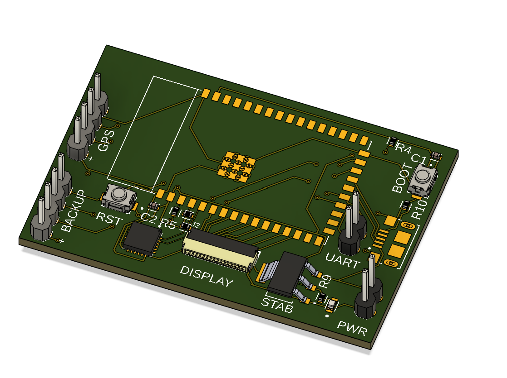
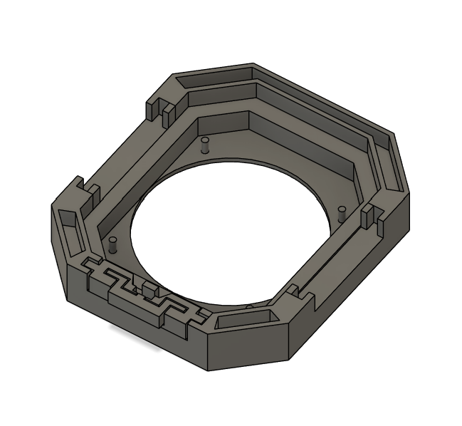
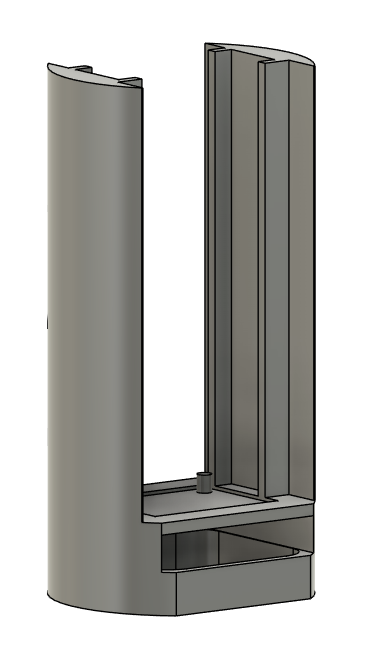

## Cycling Buddy - Smart Cycling Computer

  
*The backend PCB design of Cycling Buddy.*

This is Cycling Buddy, a smart cycling computer I designed in 2023. The project aimed to fill a gap in the market while helping me improve my skills in PCB design, 3D modeling, and programming.

## Project Overview

Cycling Buddy consists of two main components:

### 1. **Compute Engine**
- **Location**: Housed within the bike’s steering shaft.
- **Features**:
  - **ESP32 Microcontroller**: The core of the compute engine, managing all system operations.
  - **Neo 6M GPS Module**: Enables real-time location tracking and navigation.
  - **MPU6050 Sensor**: Provides gyroscope and accelerometer data for precise movement and orientation tracking.
  - **Battery**: Powers the entire system.

### 2. **User Interface (UI)**
- **Features**:
  - **1.28" Round IPS Display**: Provides clear and vibrant visualization of data.
  - Buttons for user interaction and control.
- **Connection**: Wired connection to the compute engine (originally flex cable).

Due to an error in the original UI PCB design, the physical product had to be redesigned, and the UI PCB was ultimately not utilized in the final implementation.

  
*Original UI case design for the Cycling Buddy.*

---

## Key Features
- **Modular Design**: Separate compute and UI components for flexibility and efficient upgrades.
- **Advanced Sensors**: Integration of GPS and MPU6050 for detailed tracking and analytics.
- **Custom Housing**: Designed to fit seamlessly within the bike's steering shaft for a sleek and practical solution.
- **Skill Development**: I got significantly better at:
  - PCB design
  - 3D modeling
  - Firmware and software development

---

## Technical Details
### Hardware
- **Microcontroller**: ESP32-S2-WROOM
- **Sensors**:
  - Neo 6M GPS Module
  - MPU6050 (Gyroscope and Accelerometer)
- **Power**: Rechargeable battery integrated into the compute engine
- **User Interface**:
  - 1.28" Round IPS Display
  - Buttons for navigation and control

### Software
- **Firmware**:
  - Developed for the ESP32 microcontroller.
  - Handles communication between sensors, UI, and external devices (intended for custom app communication).
- **Programming Languages**: C/C++ (for firmware)

### Mechanical Design
- **3D Modeled Housing**: Precision-designed to fit the bike’s steering shaft while protecting internal components.

---

## Challenges and Solutions
### Challenge: UI PCB Design Error
- **Issue**: An error in the UI board rendered it unusable.
- **Solution**: Redesigned the physical product to function without the UI PCB, ensuring the project remained operational.

  
*Outer casing design for the Cycling Buddy.*

### Challenge: Component Integration
- **Solution**: Iterative testing and debugging to ensure seamless communication between the compute engine and UI.

---

## Lessons Learned
This project significantly contributed to my growth in hardware and software development, particularly in:
- Iterative PCB design and error resolution.
- Advanced 3D modeling techniques for custom enclosures.
- Embedded programming for real-time systems.

I also learned how important it is to handle interference between components and data cables.

---

## Future Improvements
- **Move everything to 1 PCB**: Redesign the whole computer to utilize only one PCB and let the mobile app handle more complex tasks (positioning, real-time info, etc.).
- **Improved UI Design**: Finalize a revised UI PCB and incorporate additional features.
- **Enhanced Power Management**: Optimize battery life for longer usage.

---

## License
This project is licensed under the MIT License. See the `LICENSE` file for details.
